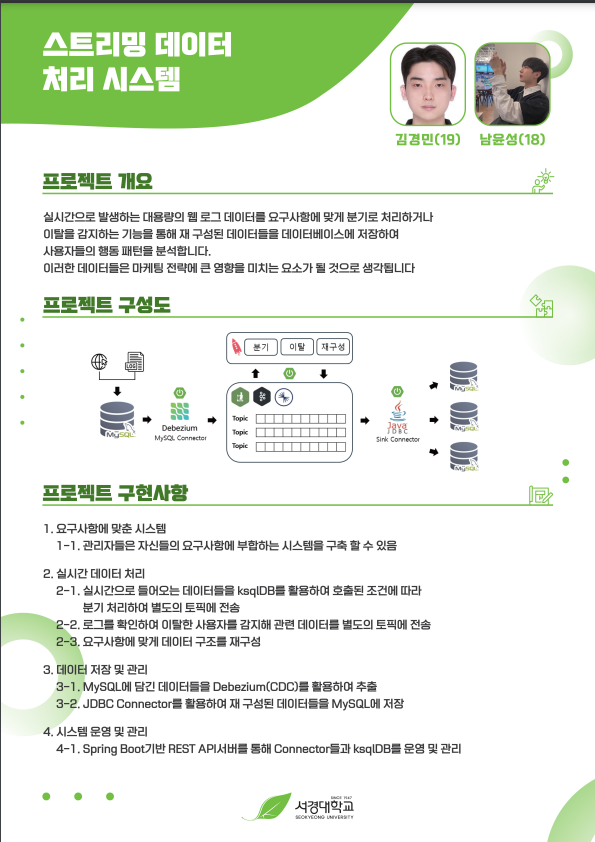

# Spring과 Kafka를 이용한 실시간 스트리밍 데이터 처리 시스템

## 📚 목차
- [📖 소개](#소개)
- [🛠️ 개발 환경](#개발-환경)
- [🎯 주요 기능](#주요-기능)
- [📝 API 호출 사용법](#api-호출-사용법)
- [🔧 트러블 슈팅](#트러블-슈팅)

## 📖 소개

**프로젝트 기간**: 2024년 4월 21일 ~ 2024년 6월 24일

이 프로젝트는 **웹 로그 데이터를 실시간으로 처리**하는 시스템을 구축하는 것을 목표로 했습니다.  
Kafka와 Spring Boot를 활용하여 웹에서 생성되는 로그 데이터를 실시간으로 데이터베이스에 수집하고, 사용자가 원하는 기준에 맞춰 데이터를 가공하여 target 데이터베이스에 저장합니다.

주요 기능으로는,  
- **이탈 감지**: 이상 로그를 실시간으로 모니터링하여 빠르게 대응할 수 있습니다.  
- **분기 처리**: 특정 조건에 따라 로그 데이터를 다른 경로로 처리할 수 있습니다.
- **재구성**: 원하는 컬럼을 추가하거나 삭제하여 로그 데이터를 재구성 할 수 있습니다.

이 시스템은 빠르게 변하는 웹 환경에서 효율적인 로그 관리와 분석을 가능하게 하며, **마케팅 전략 수립에 큰 도움**을 줄 수 있습니다.

## 🛠️ 개발 환경

이 프로젝트에서는 다음과 같은 기술 스택과 도구들이 사용되었습니다:

### 기술 스택

- **Back-end**: Spring Boo을 감지하고, 이탈 상황을 실시간으로 모니터링합니다.
   - 이를 통해 사용자 이탈을 실시간으로 파악할 수 있습니다.

5. **데이터베이스 연동**
   - JDBC Sink Connector를 통해 Kafka에서 수집된 데이터를 MySQL 데이터베이스에 저장합니다.

6. **일시정지 및 재가동**
   - API 호출을 통해 각 Connector별로 일시정지 및 재가동을 가능하게 만들어 운용을 용이하게 만들었습니다.

## 📝 API 호출 사용법

이 섹션에서는 Kafka와 데이터베이스 간의 연결을 설정하고, 스트림을 관리 및 처리하는 주요 API를 설명합니다.

### 1. JDBC Sink Connector 생성

- **API**: `POST /kafka/sinkConnector/{connectorName}/{topicName}/{DBName}/{tableName}/{keyColumn}`
- **설명**: Kafka 데이터를 MySQL 등의 데이터베이스에 저장하기 위한 JDBC Sink Connector를 생성합니다.
- **파라미터**:
  - `connectorName`: 커넥터의 이름
  - `topicName`: Kafka 토픽 이름
  - `DBName`: 데이터베이스 이름
  - `tableName`: 저장할 테이블 이름
  - `keyColumn`: 키로 사용할 컬럼

### 2. Debezium Source Connector 생성

- **API**: `POST /kafka/sourceConnector/{connectorName}/{serverID}/{serverName}/{DBName}/{tableName}/{rawStreamName}`
- **설명**: Debezium을 사용해 MySQL과 같은 데이터베이스의 변경 사항을 Kafka로 스트리밍하기 위한 Source Connector를 생성합니다.
- **파라미터**:
  - `connectorName`: 커넥터 이름
  - `serverID`: 서버 ID
  - `serverName`: 서버 이름
  - `DBName`: 데이터베이스 이름
  - `tableName`: 테이블 이름
  - `rawStreamName`: 원본 데이터 스트림 이름

### 3. 스트림 생성

- **API**: `POST /kafka/createStream/{streamName}/{topicName}/{rawStreamName}`
- **설명**: Kafka 스트림을 생성합니다.
- **파라미터**:
  - `streamName`: 생성할 스트림의 이름
  - `topicName`: 연결할 Kafka 토픽의 이름
  - `rawStreamName`: 원본 데이터 스트림의 이름

### 4. 컬럼 추가

- **API**: `POST /kafka/addColumn/{sourceStreamName}/{streamName}/{topicName}/{columnName}/{dataType}/{withPartitions}`
- **설명**: 지정한 Kafka 스트림에 새로운 컬럼을 추가합니다.
- **파라미터**:
  - `sourceStreamName`: 원본 스트림의 이름
  - `streamName`: 새 스트림의 이름
  - `topicName`: 연결할 Kafka 토픽의 이름
  - `columnName`: 추가할 컬럼의 이름
  - `dataType`: 컬럼의 데이터 타입
  - `withPartitions`: 파티션 사용 여부 (true/false)

### 5. 컬럼 삭제

- **API**: `POST /kafka/dropColumn/{sourceStreamName}/{newStreamName}/{topicName}/{excludedColumnName}`
- **설명**: Kafka 스트림에서 지정된 컬럼을 제외하고 새로운 스트림을 생성합니다.
- **파라미터**:
  - `sourceStreamName`: 원본 스트림의 이름
  - `newStreamName`: 새로 생성할 스트림의 이름
  - `topicName`: 연결할 Kafka 토픽의 이름
  - `excludedColumnName`: 제외할 컬럼의 이름

### 6. 데이터 필터링

- **API**: `POST /kafka/filter/{sourceStreamName}/{streamName}/{topicName}/{columnName}/{condition}/{operation}/{isNumeric}/{withPartitions}`
- **설명**: 지정된 조건과 연산을 통해 데이터를 필터링한 후 Kafka 스트림을 생성합니다.
- **파라미터**:
  - `sourceStreamName`: 원본 스트림의 이름
  - `streamName`: 새로 생성될 필터된 스트림 이름
  - `topicName`: 연결할 Kafka 토픽의 이름
  - `columnName`: 조건을 적용할 컬럼의 이름
  - `condition`: 필터링할 조건
  - `operation`: 필터링 연산자 (예: `=`, `>`, `<`)
  - `isNumeric`: 데이터가 숫자인지 여부 (true/false)
  - `withPartitions`: 파티션 사용 여부 (true/false)

### 7. 이탈 감지

- **API**: `POST /kafka/exitDetection/{sourceStreamName}/{streamName}/{topicName}`
- **설명**: Kafka 스트림에서 이탈 감지 작업을 수행합니다.
- **파라미터**:
  - `sourceStreamName`: 원본 스트림의 이름
  - `streamName`: 새로 생성할 이탈 감지 스트림의 이름
  - `topicName`: 연결할 Kafka 토픽의 이름

### 8. 스트림 설명

- **API**: `GET /kafka/describe/{sourceStreamName}`
- **설명**: 지정된 스트림의 메타데이터를 설명합니다.
- **파라미터**:
  - `sourceStreamName`: 설명할 스트림의 이름

## 🔧 트러블 슈팅

### ksqlDB의 JSON 데이터 처리 문제

- JSON 데이터를 처리할 때, 각 메세지에 **Key와 Value의 Schema , Payload가 포함**됩니다.
    - 이는 메시지 크기를 증가시켜 저장 공간을 비효율적으로 사용하게 만들었습니다.
    - 예를 들어, 작은 크기의 데이터라도 스키마 페이로드로 인해 메시지 하나당 용량이 불필요하게 커졌었습니다.
- 또한, 스키마를 포함한 JSON 메시지에서 **ksqlDB가 특정 데이터 필드를 제대로 인식하지 못하는 오류**가 발생했습니다
    - 스키마의 중복된 정의나 불필요한 메타데이터로 인해 처리 과정에서 데이터 타입이 불일치하거나 일부 필드가 누락되는 상황이 발생했습니다.

---

### Avro 및 Schema Registry 도입 과 해결

- 이를 해결하기 위해 **Avro 형식과 Schema Registry**를 도입했습니다.
    - **Avro**는 스키마 정보를 별도로 관리하고, 메시지 본문에는 데이터만 포함되도록 설계되어 메시지 크기를 줄여 효율성을 높였습니다.
    - **Schema Registry**를 활용해 스키마를 중앙에서 관리하며, 데이터 타입과 필드 구조를 명확히 정의함으로써 ksqlDB의 데이터 처리 오류를 방지할 수 있었습니다.

---

**결과적으로**, Avro와 **Schema Registry**를 도입함으로써 데이터 처리 효율성과 일관성을 확보하고, ksqlDB와의 호환성을 강화할 수 있었습니다.

