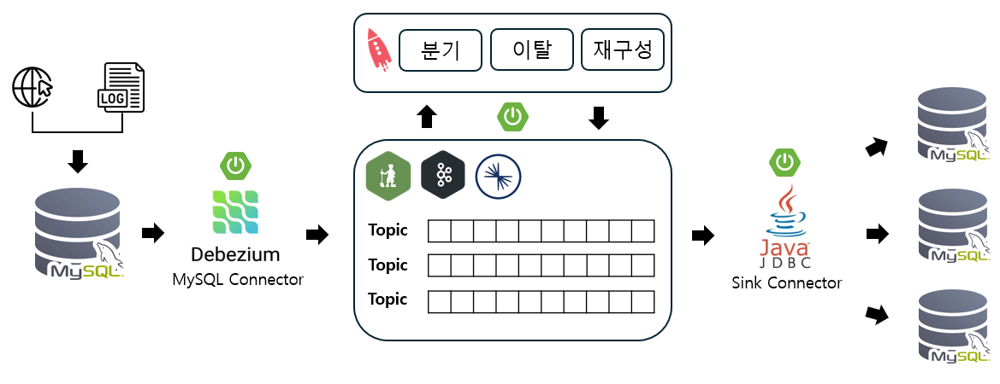

# Kafka-Spring Project

Spring과 Kafka를 이용한 실시간 스트리밍 데이터 처리 시스템

## 목차
- [소개](#소개)
- [시스템 아키텍처](#시스템-아키텍처)
- [설치](#설치)
- [사용법](#사용법)
- [주요 기능](#주요-기능)
- [사용된 기술 스택](#사용된-기술-스택)
- [기여 방법](#기여-방법)
- [라이선스](#라이선스)
- [연락처](#연락처)

## 소개

이 프로젝트는 **2024년 4월 21일부터 6월 24일까지** 진행된 실시간 스트리밍 데이터 처리 시스템 구축 프로젝트입니다.  
웹에서 실시간으로 생성되는 데이터를 수집하고, 지정된 기준에 맞춰 데이터를 가공한 후 데이터베이스에 저장하는 시스템을 구현하였습니다.  

이 시스템은 데이터 분석 및 처리를 통해 마케팅 전략 수립에 큰 영향을 미칠 수 있는 중요한 정보를 제공합니다.  
특히, 실시간으로 데이터를 처리함으로써 사용자 행동을 빠르게 파악하고, 이에 맞춘 마케팅 전략을 실시간으로 조정할 수 있어  
기업의 성과 향상에 기여할 수 있습니다.

## 시스템 아키텍처
이 시스템은 Kafka를 메시지 브로커로 사용하는 프로듀서-컨슈머 아키텍처를 따릅니다. 아래 다이어그램은 데이터의 흐름을 나타냅니다:

