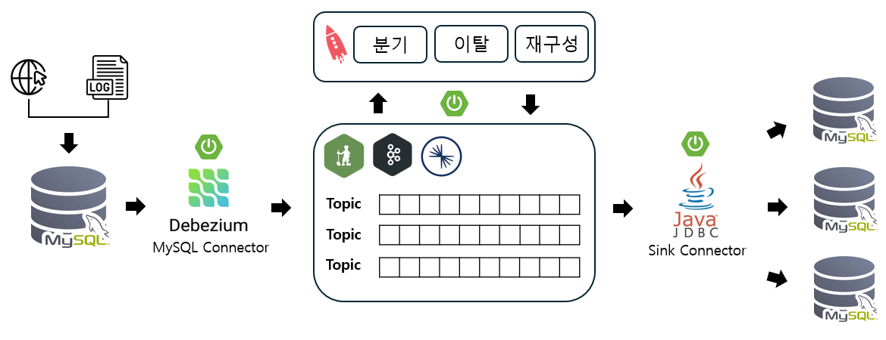

# Kafka-Spring Project


Spring과 Kafka를 이용한 실시간 스트리밍 데이터 처리 시스템

## 목차
- [소개](#소개)
- [개발 환경](#개발-환경)
- [시스템 아키텍처](#시스템-아키텍처)
- [주요 기능](#주요-기능)
- [API 호출 사용법](#api-호출-사용법)
- [트러블 슈팅](#트러블-슈팅)

## 소개

- **프로젝트 기간**: 2024년 4월 21일 ~ 2024년 6월 24일

이 프로젝트는 **웹 로그 데이터를 실시간으로 처리**하는 시스템을 구축하는 것을 목표로 했습니다.  
Kafka와 Spring Boot를 활용하여 웹에서 생성되는 로그 데이터를 실시간으로 데이터베이스에 수집하고, 사용자가 원하는 기준에 맞춰 데이터를 가공하여 target 데이터베이스에 저장합니다.

주요 기능으로는,  
- **이탈 감지**: 이상 로그를 실시간으로 모니터링하여 빠르게 대응할 수 있습니다.  
- **분기 처리**: 특정 조건에 따라 로그 데이터를 다른 경로로 처리할 수 있습니다.
- **재구성**: 원하는 컬럼을 추가하거나 삭제하여 로그 데이터를 재구성 할 수 있습니다.

이 시스템은 빠르게 변하는 웹 환경에서 효율적인 로그 관리와 분석을 가능하게 하며, **마케팅 전략 수립에 큰 도움**을 줄 수 있습니다.

## 개발 환경

이 프로젝트에서는 다음과 같은 기술 스택과 도구들이 사용되었습니다:

### 기술 스택

- **Back-end**: Spring Boot, Confluent Kafka
- **Database**: MySQL
- **메시지 브로커**: Confluent Kafka
- **메시지 브로커 관리**: Zookeeper
- **스트리밍 데이터 처리**: ksqlDB
- **데이터 변경 캡처(CDC)**: Debezium
- **빌드 도구**: Gradle

### 사용된 도구

- **IDE**: IntelliJ IDEA
- **가상 환경**: Oracle VirtualBox (VM)
- **터미널 관리 도구**: MTPuTTY
- **API 테스트 도구**: Postman

### 기술 스택 다이어그램



## 시스템 아키텍처

```bash
├── README.md
├── .gitignore
├── pom.xml
├── src
│   ├── main
│   │   ├── java
│   │   │   └── com
│   │   │       └── example
│   │   │           └── kafkaproject
│   │   │               ├── config
│   │   │               │   └── appConfig.java        # 애플리케이션의 설정을 관리하는 클래스
│   │   │               ├── connector
│   │   │               │   ├── sinkConnector.java    # Kafka와 데이터베이스 연동을 담당하는 Sink Connector
│   │   │               │   └── sourceConnector.java  # 데이터 소스와 Kafka 연동을 담당하는 Source Connector
│   │   │               ├── controller
│   │   │               │   └── kafkaController.java  # Kafka 관련 요청을 처리하는 컨트롤러
│   │   │               ├── log
│   │   │               │   └── createLog.java        # 로그 생성 및 처리 담당
│   │   │               ├── service
│   │   │               │   ├── addColumn.java        # 테이블에 컬럼을 추가하는 로직
│   │   │               │   ├── createStream.java     # Kafka 스트림을 생성하는 로직
│   │   │               │   ├── describe.java         # 테이블/스트림 설명을 담당하는 서비스
│   │   │               │   ├── dropColumn.java       # 테이블에서 컬럼을 삭제하는 로직
│   │   │               │   ├── exitDetection.java    # 이탈 감지 로직
│   │   │               │   └── filter.java           # 데이터 필터링 로직
│   │   │               └── kafkaApplication.java     # 애플리케이션의 메인 실행 파일
│   └── resources
│       ├── application.properties                     # Spring Boot 애플리케이션 설정 파일
│       └── kafka-config.yml                           # Kafka 관련 설정 파일
```

## 주요 기능

이 프로젝트는 웹 로그 데이터를 실시간으로 처리하고 다양한 분석과 데이터 처리를 수행할 수 있는 기능을 제공합니다. 주요 기능은 다음과 같습니다:

1. **실시간 로그 데이터 수집**
   - Kafka를 통해 웹 로그 데이터를 실시간으로 수집하고 이를 다양한 스트림으로 처리합니다. 이를 통해 실시간 데이터를 효과적으로 관리할 수 있습니다.

2. **데이터 필터링 및 가공**
   - 지정된 조건에 따라 로그 데이터를 필터링하거나 특정 컬럼을 추가/제거하여 데이터를 가공할 수 있습니다. 이를 통해 로그 데이터를 분석 가능한 형태로 변환할 수 있습니다.

3. **이탈 감지**
   - Debezium과 Kafka를 활용하여 사용자 활동에서 이상 징후를 감지하고, 이탈 상황을 실시간으로 모니터링합니다. 이를 통해 사용자 이탈을 실시간으로 파악할 수 있습니다.

4. **분기 처리**
   - 특정 조건을 기반으로 데이터를 다른 경로로 분기 처리하여 다양한 시나리오에 맞게 데이터를 처리할 수 있습니다.

5. **데이터베이스 연동**
   - JDBC Sink Connector를 통해 Kafka에서 수집된 데이터를 MySQL 데이터베이스에 저장합니다.

6. **데이터 변경 캡처(CDC)**
   - Debezium을 사용하여 데이터베이스에서 발생하는 변경 사항을 실시간으로 Kafka 스트림으로 전송합니다.

## API 호출 사용법

이 섹션에서는 Kafka와 데이터베이스 간의 연결을 설정하고, 스트림을 관리 및 처리하는 주요 API를 설명합니다.

### 1. JDBC Sink Connector 생성

- **API**: `POST /kafka/sinkConnector/{connectorName}/{topicName}/{DBName}/{tableName}/{keyColumn}`
- **설명**: Kafka 데이터를 MySQL 등의 데이터베이스에 저장하기 위한 JDBC Sink Connector를 생성합니다.
- **파라미터**:
  - `connectorName`: 커넥터의 이름
  - `topicName`: Kafka 토픽 이름
  - `DBName`: 데이터베이스 이름
  - `tableName`: 저장할 테이블 이름
  - `keyColumn`: 키로 사용할 컬럼

### 2. Debezium Source Connector 생성

- **API**: `POST /kafka/sourceConnector/{connectorName}/{serverID}/{serverName}/{DBName}/{tableName}/{rawStreamName}`
- **설명**: Debezium을 사용해 MySQL과 같은 데이터베이스의 변경 사항을 Kafka로 스트리밍하기 위한 Source Connector를 생성합니다.
- **파라미터**:
  - `connectorName`: 커넥터 이름
  - `serverID`: 서버 ID
  - `serverName`: 서버 이름
  - `DBName`: 데이터베이스 이름
  - `tableName`: 테이블 이름
  - `rawStreamName`: 원본 데이터 스트림 이름

### 3. 스트림 생성

- **API**: `POST /kafka/createStream/{streamName}/{topicName}/{rawStreamName}`
- **설명**: Kafka 스트림을 생성합니다.
- **파라미터**:
  - `streamName`: 생성할 스트림의 이름
  - `topicName`: 연결할 Kafka 토픽의 이름
  - `rawStreamName`: 원본 데이터 스트림의 이름

### 4. 컬럼 추가

- **API**: `POST /kafka/addColumn/{sourceStreamName}/{streamName}/{topicName}/{columnName}/{dataType}/{withPartitions}`
- **설명**: 지정한 Kafka 스트림에 새로운 컬럼을 추가합니다.
- **파라미터**:
  - `sourceStreamName`: 원본 스트림의 이름
  - `streamName`: 새 스트림의 이름
  - `topicName`: 연결할 Kafka 토픽의 이름
  - `columnName`: 추가할 컬럼의 이름
  - `dataType`: 컬럼의 데이터 타입
  - `withPartitions`: 파티션 사용 여부 (true/false)

### 5. 컬럼 삭제

- **API**: `POST /kafka/dropColumn/{sourceStreamName}/{newStreamName}/{topicName}/{excludedColumnName}`
- **설명**: Kafka 스트림에서 지정된 컬럼을 제외하고 새로운 스트림을 생성합니다.
- **파라미터**:
  - `sourceStreamName`: 원본 스트림의 이름
  - `newStreamName`: 새로 생성할 스트림의 이름
  - `topicName`: 연결할 Kafka 토픽의 이름
  - `excludedColumnName`: 제외할 컬럼의 이름

### 6. 데이터 필터링

- **API**: `POST /kafka/filter/{sourceStreamName}/{streamName}/{topicName}/{columnName}/{condition}/{operation}/{isNumeric}/{withPartitions}`
- **설명**: 지정된 조건과 연산을 통해 데이터를 필터링한 후 Kafka 스트림을 생성합니다.
- **파라미터**:
  - `sourceStreamName`: 원본 스트림의 이름
  - `streamName`: 새로 생성될 필터된 스트림 이름
  - `topicName`: 연결할 Kafka 토픽의 이름
  - `columnName`: 조건을 적용할 컬럼의 이름
  - `condition`: 필터링할 조건
  - `operation`: 필터링 연산자 (예: `=`, `>`, `<`)
  - `isNumeric`: 데이터가 숫자인지 여부 (true/false)
  - `withPartitions`: 파티션 사용 여부 (true/false)

### 7. 이탈 감지

- **API**: `POST /kafka/exitDetection/{sourceStreamName}/{streamName}/{topicName}`
- **설명**: Kafka 스트림에서 이탈 감지 작업을 수행합니다.
- **파라미터**:
  - `sourceStreamName`: 원본 스트림의 이름
  - `streamName`: 새로 생성할 이탈 감지 스트림의 이름
  - `topicName`: 연결할 Kafka 토픽의 이름

### 8. 스트림 설명

- **API**: `POST /kafka/describe/{sourceStreamName}`
- **설명**: 지정된 스트림의 메타데이터를 설명합니다.
- **파라미터**:
  - `sourceStreamName`: 설명할 스트림의 이름

## 트러블 슈팅

### ksqlDB에서 JSON 데이터 처리 문제

- **문제**:  
  JSON 형식의 데이터를 ksqlDB로 실시간 처리할 때, `key`와 `value` 값이 명확하게 인식되지 않는 문제가 발생했습니다. 이로 인해 데이터 처리 중 불일치가 발생하였습니다.

- **해결**:  
  JSON 대신 **Avro** 타입을 사용하여 데이터를 처리하기로 했습니다.  
  Avro는 스키마 기반의 데이터 직렬화 시스템으로, ksqlDB가 `key`와 `value` 값을 명확하게 인식할 수 있게 되었습니다. 이를 통해 실시간 데이터 처리가 안정적으로 이루어졌으며, 데이터 일관성도 확보되었습니다.


